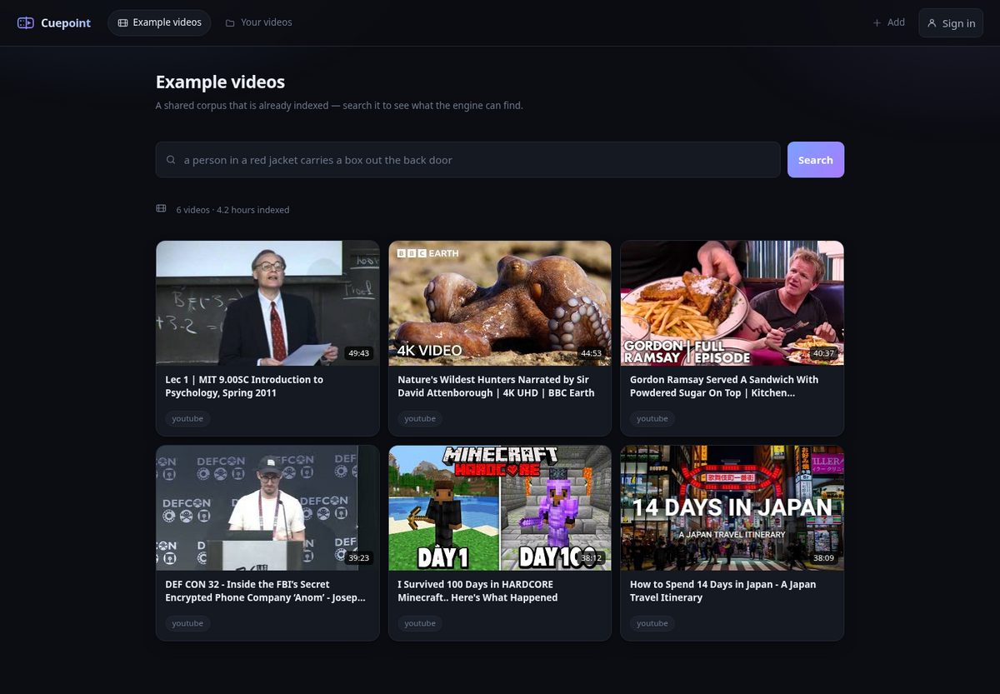
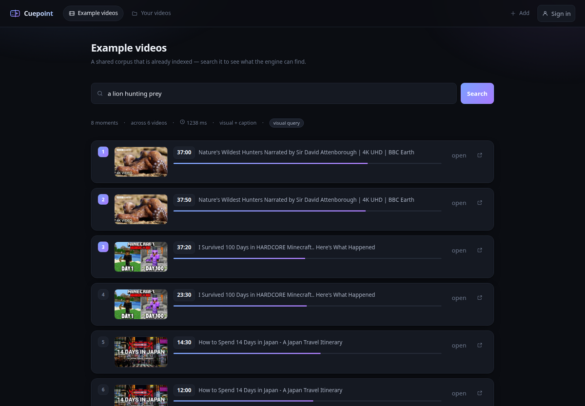
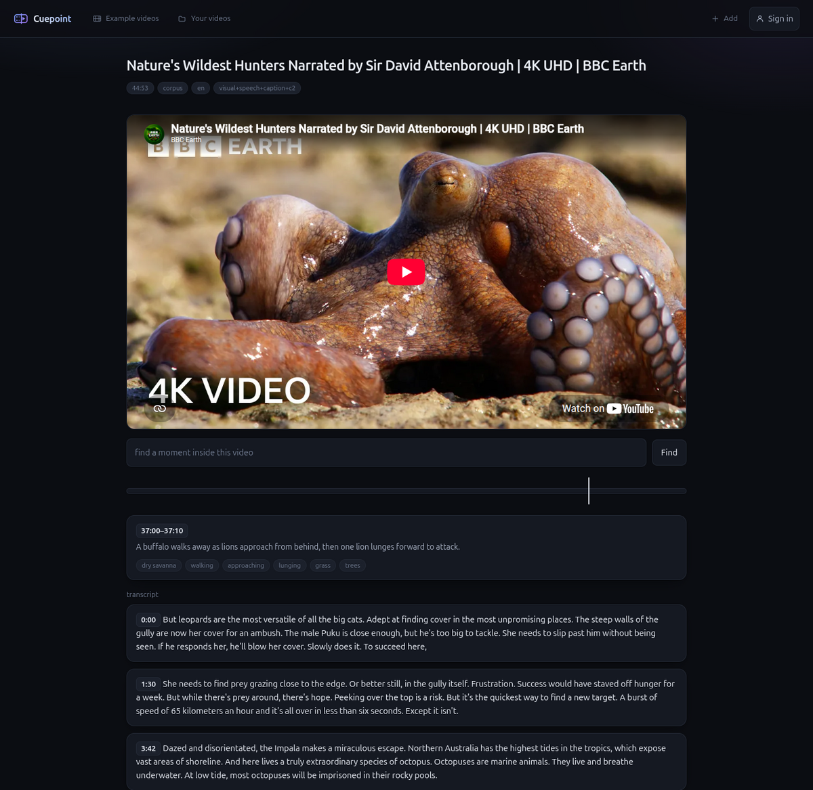

<h1 align="center">Cuepoint</h1>

<p align="center">
  <b>Semantic search over video.</b><br>
  Describe a moment in natural language; get ranked <code>(video, start, end)</code> spans back from the whole library.
</p>

<p align="center">
  <a href="https://cuepoint-zfga.onrender.com/"><b>Live demo →</b></a>
</p>



---

## What it does

The unit of retrieval is a **moment**, not a file. A query runs across every
indexed video at once, and one video can return several times at different
timestamps. Nothing is hand-labeled — the index is built entirely from model
output.

Four independent signals are extracted per clip and searched separately, then
fused. Real results from the demo library, which is 4.2 hours of unannotated
video:

| Query | Top hit |
|---|---|
| *a lion hunting prey* | **37:00** — "A buffalo walks away as lions approach from behind, then one lion lunges forward to attack." |
| *explaining how human memory works* | **28:20** — "A man in a suit gestures while holding paper, standing before a chalkboard with equations, as students raise hands." |
| *walking through a busy japanese street at night* | **36:50** — "A black taxi stops at a crosswalk in a crowded, neon-lit street at night, pedestrians walking past, signs glowing overhead." |
| *plating a finished dish in a restaurant kitchen* | **34:50** — "A chef prepares food while another worker moves plates and equipment in a kitchen area." |



## Indexing

`python/index.py` segments each video into **10-second clips**, samples frames
at **1 fps**, and runs four extractors. All of it is GPU-bound and local-only.

| Stage | Model | Output |
|---|---|---|
| Visual embedding | SigLIP 2 `so400m-patch14-384` | 1152-d vector per clip |
| Captioning | Qwen3-VL-4B-Instruct, 4-bit NF4 | JSON: `caption`, `people`, `objects[]`, `actions[]`, `setting` |
| Caption embedding | bge-m3 | 1024-d vector |
| Speech | faster-whisper `large-v3-turbo` (int8_float16), Silero VAD | transcript segments → 1024-d vector |
| Keyword | Postgres `tsvector` | GIN-indexed `clips.fts` |

Two embedders on purpose: SigLIP is strong image→text and weak text→text, so
captions and transcripts go to bge-m3 instead.

The captioner sees **6 frames per clip**, not one, so it describes change
("walks in and sets a box down") rather than a still. Output is constrained to
a JSON schema. Generation runs unconstrained first and falls back to a
schema-enforcing logits processor only for clips that fail to parse — the
enforcer costs ~5x throughput, and most clips never need it.

Whisper hallucinates on silence, so VAD gates it and segments are dropped on
`avg_logprob < -1.0`, `no_speech_prob > 0.6`, `language_probability < 0.5`.
Non-English audio uses `task="translate"` so transcripts land in English
alongside captions, with the detected language kept as a filter field.

Each video records the `PIPELINE_VERSION` it was built with, so "what needs
reindexing" is a query rather than a guess. Cost is roughly **one minute of
GPU per minute of video** on an RTX 3090.

## Retrieval

`python/search.py` is a long-lived worker speaking line-delimited JSON over
stdin/stdout. The Go API owns the HTTP surface and shells out to it.

**1. Query planning.** A Gemini flash-lite call classifies the query as
`visual` / `speech` / `mixed` and rewrites it once per index — the visual index
gets a camera description, the speech index gets what a person would actually
say, the keyword index gets only rare literal terms. The class selects a weight
profile:

```
visual   visual 1.0   caption 1.0   speech 0.0   keyword 0.00
speech   visual 0.0   caption 0.0   speech 1.0   keyword 0.50
mixed    visual 1.0   caption 1.0   speech 0.6   keyword 0.25
```

Planning is optional and synchronous with a 10s timeout; on failure search
proceeds with the raw query and default weights.

**2. Candidate retrieval.** Each enabled signal returns its top `200` clips —
cosine distance over pgvector for the three dense indexes, `ts_rank_cd` for
keyword. There is no ANN index: at this corpus size an exact scan is faster
than maintaining HNSW, so the vector columns are unindexed by design.

**3. Weighted RRF.** Rankings are merged by reciprocal rank fusion,
`score += weight / (60 + rank)`, over the full candidate pool rather than the
top *k* — fusing truncated lists would cut moments at the page boundary.

**4. Relevance calibration.** RRF ranks; it does not measure. Its top score is
identical whether or not anything actually matched, which makes it useless as a
confidence value and useless as a cutoff. Raw similarity is therefore
normalised per signal against measured ceilings (`visual 0.17`, `caption 0.72`,
`speech 0.72`, `keyword 1.0`) to produce the 0–1 number the UI shows and the
floor that suppresses empty results.

**5. Moment assembly.** Adjacent clips matching the same event are merged by a
greedy seed-and-grow pass — strongest clip first, extending while neighbours
stay above a decayed threshold, capped per video. Playback seeks to the
strongest clip (`peak_s`), not the span's edge.

Every result carries the clips behind it, so the player can mark them on the
timeline and show the caption and transcript that produced the match.



## Data model

Postgres 16+ with pgvector. Eight tables; the interesting ones:

| Table | |
|---|---|
| `videos` | locator, duration, state, `pipeline`, `owner`, `expires_at` |
| `clips` | span, caption, structured tags, speech text, `fts` tsvector |
| `clip_vectors` | `visual vector(1152)`, `caption_vec vector(1024)`, `speech_vec vector(1024)` |
| `transcript_segments` | timed speech with per-segment confidence |
| `clip_frames` | frame timestamps (the images themselves are deleted after captioning) |

Ownership is one column: `owner` holds `"anon:<session>"`, `"user:<id>"` or
`NULL` for the shared corpus, so the three collections are one query shape.
Anonymous uploads carry a 1-day `expires_at`.

Migrations are goose, embedded in the binary — `server migrate up` needs no
files on disk.

### No video is ever stored

There is no object storage and no uploads bucket. A video is a **locator**:

```json
{"kind": "youtube", "id": "bP5KfdFJzC4", "offset": 660}
{"kind": "http",    "url": "https://.../clip.mp4"}
```

Playback points at the original source, and thumbnails come from YouTube's own
CDN. Consequence worth designing around: a locator can rot, so `last_verified`
is tracked and the player degrades to "unavailable" while the moment stays
searchable.

## Architecture

```
React + TS  ──►  Go API (chi)  ──►  Postgres + pgvector
                      │
                      ├──►  search.py   (long-lived, CPU-capable)
                      └──►  index.py    (GPU, local only)
```

**The one invariant: the search path reaches only the database.** It never
imports indexing code, which is what lets search run CPU-only against an
already-built index while indexing stays GPU-bound. `scripts/check-boundary.sh`
enforces it.

Models live in long-running processes rather than one-shot scripts because
loading SigLIP and bge-m3 costs more than answering a query does.

Indexing is serialised through a single worker goroutine with a per-owner job
queue; jobs are detached from the request context, so closing the tab does not
kill the run.

### Deployment

The deployed instance has no GPU and 512 MB of RAM, which is not enough for any
of these models. With `REMOTE_MODELS=true` both workers push their payload to a
**Kaggle T4 kernel** instead: search returns through the kernel log, while
indexing writes its rows to the database directly (a 40-minute video produces
~15,000 embeddings — far too much to pass back through a log). Search is
serialised by a lock, since concurrent kernels are limited per account.

The image installs `requirements-remote.txt` — numpy and the Kaggle client,
no torch — so it builds to **241 MB and idles at ~24 MB RSS**. Search costs
~2 minutes that way, against ~1.2 s locally.

## Running locally

Docker, Go 1.26, Node 22, Python 3.12, `uv`. A GPU is needed only for indexing.

```bash
make venv      # uv venv + requirements.txt (torch, transformers, whisper)
make db-up     # postgres + pgvector in docker
make migrate   # apply the schema
make run       # API + built frontend on :8080
```

`DB=aiven make run` points at the hosted database instead. The venv lives at
`~/.venvs/video-search` rather than in the repo, and only `make` reads `.env`.

## Limitations

- **Retrieval quality is not benchmarked.** The examples above are real and
  reproducible, but there is no Recall@k or nDCG number behind any of it yet.
  The `speech` and `mixed` weight profiles in particular are asserted, not
  measured.
- **The hosted demo is slow** — ~2 minutes per search via Kaggle, plus ~50 s of
  cold start if the free instance has gone to sleep.
- **In-memory job state.** A container restart loses an in-flight index job;
  the row it claimed is released at startup and can be retried.
